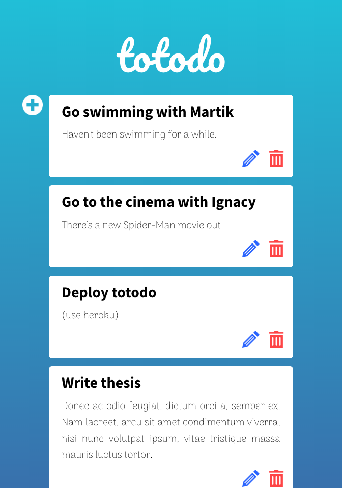

# totodo

## Description
A simple, single-page mobile-first responsive to-do app which allows the user to add, remove, edit and view to-do tasks which are stored in a database.

Visit [this link](https://totodo-client.herokuapp.com/) to see the deployed app.

## Technology stack
- MongoDB
- Express
- ReactJS
- Node.js

## To run this app on your own machine
Enter the directory of the cloned repository in a terminal, then run `sh setup.sh`

What this script will do:
- install node modules in totodo-server directory
- run server-side nodemon in the background using `npm run watch &`
- install node modules in totodo-client directory
- run client-side node instance using `npm start`

### User Stories
- **Create todo** As a user I want to create a new to-do/task with a `title` and a `body` and save it in the database.
- **List to-dos** As a user I want to see all my to-dos in a list.
- **Delete to-do** As a user I want to delete a to-do from the list.
- **Edit to-do** As a user I want to edit an existing to-do.

### Backlog
- **Done** As a user I want to mark my to-do as done by ticking a checkbox.
- **Change order of to-dos** As a user I want to rearrange my to-dos through a drag-and-drop mechanism.
- **Authorisation** As a user I want to be able to create an account, log in to it and see to-dos assigned to it specifically.

## Client-side

### Components
#### ToDoList
Shows all to-dos present in the database in newest-first order. 
Each to-do is displayed as a card (which does not have its own component, but is instead defined in the ToDoList component).

Each card holds the title and body of the to-do which match the content of the `title` and `body` properties of the relevant database document.

Each card also contains an 'edit' button, which makes the EditTodo component appear instead of the card, and a 'delete' button which calls apiService to remove the to-do from the database and then updates the list to reflect the change.

#### EditTodo
Shows a form for editing an existing to-do.

The form contains inputs for the `title` and `body` properties, filled in to match the values present in the relevant to-do document in the database.

It contains a 'confirm' button which calls on apiService to update the database document 

#### AddTodo
Shows a button which makes visible the form for creating a new to-do. 

The form containst inputs for the `title` and `body` properties of a to-do document, as well as a 'confirm' and a 'cancel' button.

### Services
#### ApiService
Uses axios to make all requests to the server-side application using GET, POST, PUT and DELETE methods.

### Dependencies
- axios
- react
- react-dom
- react-scripts

## Server-side

### Endpoints
- **GET**: `api/todos/all` Gets all documents from database and returns all as a JSON object in the response, along with a 200 status code. Has no path variables or request body.
- **POST**: `api/todos/new` Creates a new to-do document in the database based on data passed in the body of the request. Responds with a 200 status code and JSON containing a message confirming operation success. Has no path variables.
- **PUT**: `api/todos/:id/update` Updates an existing to-do document in the database based on data passed in the request body. Responds with a 200 status code and a JSON object containing the resulting updated document. A path variable `id` is used to search the database for a document with a matching `_id` property.
- **DELETE**: `api/todos/:id/delete` Removes an existing to-do document from the database. Responds with a 200 status code and a JSON containing a message confirming operation success. A path variable `id` is used to search the database for a document with a matching `_id` property.

### Status codes
- **404** Path not found
- **500** Error occurred in the request
- **200** Operation successful

### Models
A single model named `Todo` is used in the server-side application, which uses the following schema:
```javascript
{
  title: {
    type: String,
    required: true
  },
  body: {
    type: String
  }
},
{ timestamps: true }
```

### Dependencies
- cors
- dotenv
- express
- mongoose

## Links

[Github repository link](http://github.com)

[Deployed App Link](http://heroku.com)
